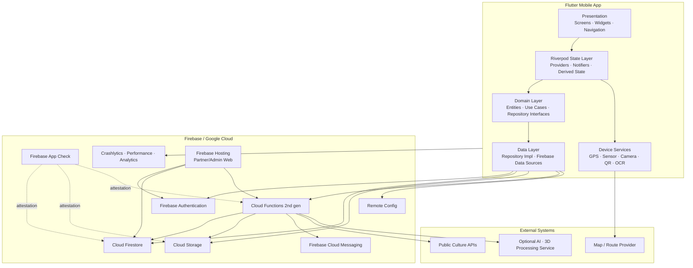
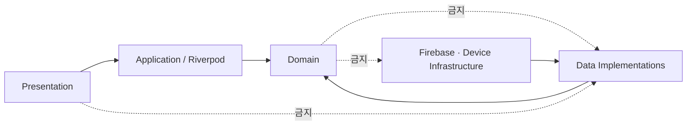
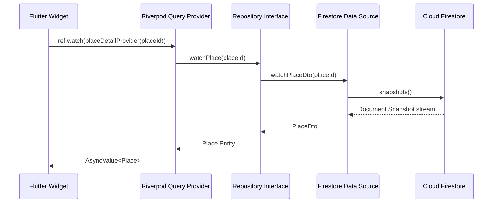
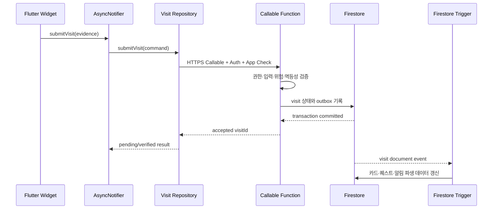
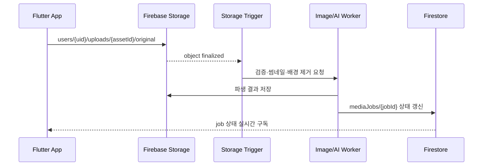
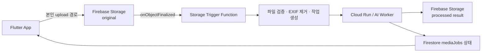
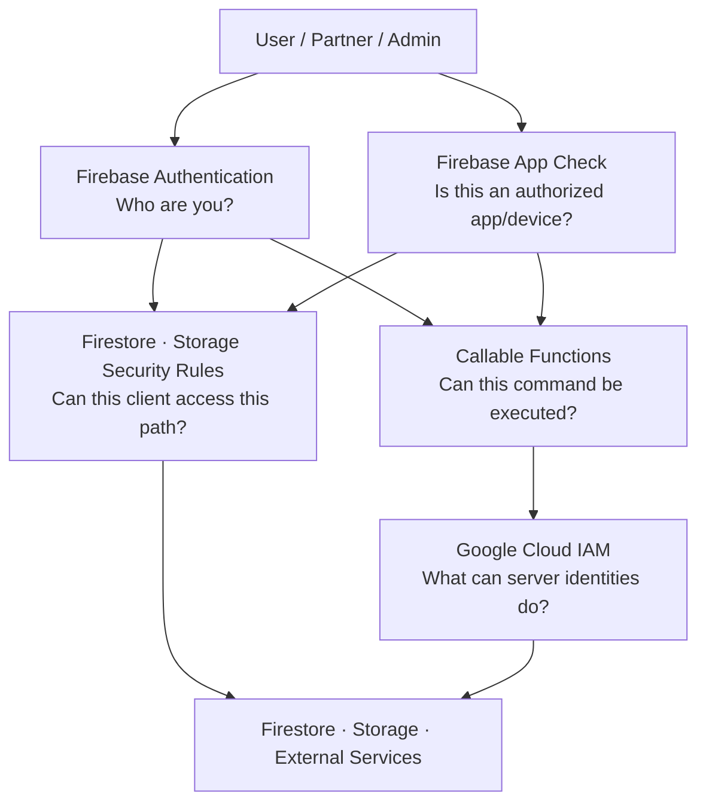
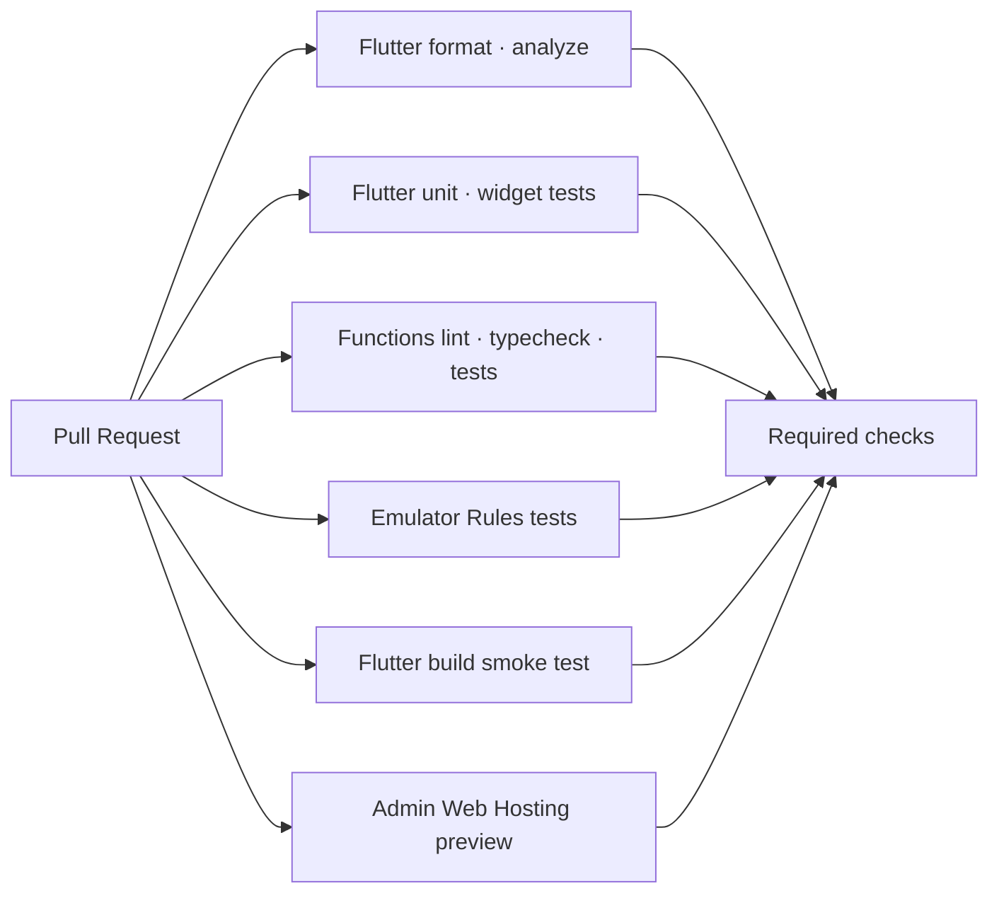
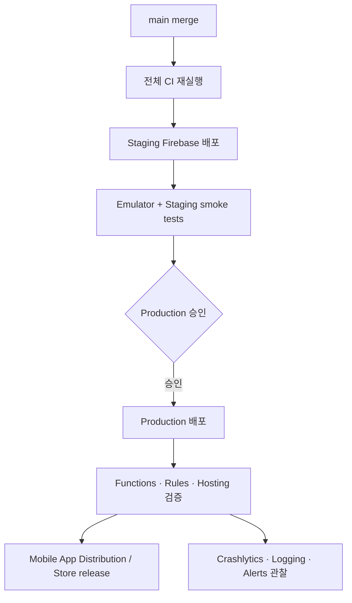

# 상세 기술 문서

## 0. 문서 요약

### 0.1. 기술 목표

본 서비스의 기술적 목표는 사용자가 주변 문화공간을 발견하고 실제로 방문한 뒤, 해당 경험을 디지털 카드와 개인 갤러리로 안전하게 수집·공유할 수 있도록 지원하는 것이다.

핵심 기술 목표는 다음과 같다.

1. 위치·센서·공식 인증 수단을 결합해 실제 방문 여부를 합리적으로 검증한다.
2. 공공데이터와 운영자 입력 데이터를 통합해 신뢰 가능한 문화공간 정보를 제공한다.
3. 사진 기반 카드 제작과 선택형 AI·3D 기능을 다양한 기기에서 안정적으로 제공한다.
4. 문화공간 추천, 도감, 희귀도, 퀘스트를 서버 정책으로 일관되게 운영한다.
5. 위치·사진·활동 기록 등 민감 데이터를 최소한으로 수집하고 보호한다.
6. 초기 지역 실증부터 향후 전국 확장까지 단계적으로 확장 가능한 구조를 만든다.

### 0.2. 기술 설계 원칙

* **감상 우선**: 기술 사용이 공연·전시 관람을 방해하지 않아야 한다.
* **실패 허용**: AI·3D 생성이 실패해도 방문 인증과 기본 카드 획득은 유지한다.
* **다중 신호 검증**: GPS, 체류 시간, QR, OCR 중 하나를 절대적 진실로 간주하지 않는다.
* **서버 권한 보장**: 보상, 카드 발급, 희귀도 변경 등 핵심 상태는 서버가 최종 결정한다.
* **온디바이스 우선, 서버 보완**: 개인정보 보호와 즉시성이 필요한 처리는 단말에서 수행하고, 무결성과 고성능 처리가 필요한 작업은 서버에서 수행한다.
* **점진적 고도화**: MVP에서는 검증된 기술로 핵심 행동 가설을 확인하고, AI·3D·AR은 이후 단계에서 확장한다.
* **관측 가능성 확보**: 인증 실패, 데이터 오류, AI 처리 지연을 측정할 수 있도록 로그와 지표를 설계한다.

### 0.3. 기술적 비목표


* 모든 스마트폰에서 실시간 고품질 3D 모델 생성
* GPS 위변조의 완전한 차단
* 공공 API만으로 전국의 모든 문화행사 실시간 수집
* 이미지 한 장만으로 정확한 실물 3D 복원
* 모든 AI 처리를 온디바이스에서 수행
* 공연·전시 작품 촬영을 전제로 한 방문 인증
* 블록체인·NFT 기반 디지털 소유권 구현

---

## 1. Firebase 기반 전체 시스템 아키텍처

### 1.1. 아키텍처 개요

본 프로젝트의 권장 구현 기준은 **Flutter + Riverpod + Firebase**이다. 모바일 앱은 읽기 중심의 공개·사용자 소유 데이터를 Firestore에서 실시간 구독하고, 방문 인증·보상 발급·희귀도 변경·운영자 승인처럼 조작 위험이 높은 명령은 Cloud Functions를 통해 수행한다.

Firebase는 다음 역할로 구분한다.

* **Firebase Authentication**: 사용자 인증과 계정 식별
* **Cloud Firestore**: 서비스의 주 데이터베이스
* **Cloud Storage for Firebase**: 이미지, 카드 결과물, 3D 에셋 저장
* **Cloud Functions for Firebase 2nd gen**: 서버 권한 명령, 트리거, 스케줄 작업
* **Firebase App Check**: 정식 앱·기기에서 발생한 요청인지 보조 검증
* **Firebase Cloud Messaging**: 카드 처리 완료, 퀘스트, 운영 변경 알림
* **Remote Config**: 인증 임계값, 기능 플래그, 실증 지역 설정
* **Crashlytics·Performance Monitoring·Analytics**: 장애, 성능, 제품 지표 관측
* **Firebase Hosting**: 운영자·관리자 웹과 공개 안내 페이지 배포
* **Local Emulator Suite**: Firestore, Auth, Storage, Functions, Rules 통합 테스트

이 구조에서 Firestore와 Storage는 Security Rules가 허용한 범위에서 모바일 앱이 직접 접근할 수 있다. 그러나 카드·보상 발급, 공식 희귀도, 방문 판정 등 신뢰 경계를 넘는 변경은 모바일 앱이 직접 기록하지 않고 Callable Function을 호출해야 한다.

### 1.2. 시스템 다이어그램



### 1.3. 컴포넌트별 역할

| 컴포넌트 | 주요 역할 | 신뢰 수준 |
| :--- | :--- | :--- |
| Flutter Presentation | 화면 렌더링, 사용자 입력, 네비게이션 | 신뢰하지 않음 |
| Riverpod State Layer | 비동기 상태, 파생 상태, 명령 상태 조정 | 신뢰하지 않음 |
| Domain Layer | 엔티티, 유스케이스, 저장소 인터페이스, 정책 모델 | 앱 내부 규칙 |
| Data Layer | Firebase SDK와 외부 SDK 호출, DTO 변환 | 신뢰하지 않음 |
| Device Services | GPS, 센서, 카메라, QR, OCR 입력 수집 | 보조 증거 |
| Firebase Authentication | 사용자 UID와 로그인 상태 제공 | 인증 신뢰 경계 |
| Firestore | 사용자·장소·방문·카드·퀘스트의 서비스 데이터 저장 | Rules 기반 접근 |
| Cloud Storage | 원본·파생 이미지와 3D 에셋 저장 | Rules 기반 접근 |
| Callable Functions | 방문 제출, 보상 발급, 운영자 명령 등 서버 권한 작업 | 서버 신뢰 경계 |
| Event Functions | Firestore·Storage 변경 후 파생 데이터 생성 | 서버 신뢰 경계 |
| Scheduled Functions | 공공데이터 동기화, 만료 처리, 집계, 정리 | 서버 신뢰 경계 |
| App Check | 정식 앱·기기 요청 여부의 보조 확인 | 단독 보안 수단 아님 |
| Remote Config | 기능 플래그와 운영 임계값 전달 | 민감 비밀 저장 금지 |
| Partner/Admin Web | 장소 관리, QR 발급, 신고 검토 | 역할 기반 제한 |

### 1.4. Flutter 레이어 구조

앱은 기능 단위 폴더와 계층 분리를 함께 적용한다.

```text
lib/
├─ app/
│  ├─ bootstrap/
│  ├─ router/
│  ├─ theme/
│  └─ firebase/
├─ core/
│  ├─ error/
│  ├─ result/
│  ├─ logging/
│  ├─ security/
│  └─ device/
├─ features/
│  ├─ auth/
│  │  ├─ presentation/
│  │  ├─ application/
│  │  ├─ domain/
│  │  └─ data/
│  ├─ discovery/
│  ├─ visit/
│  ├─ card/
│  ├─ collection/
│  ├─ gallery/
│  ├─ quest/
│  ├─ social/
│  └─ partner/
└─ shared/
   ├─ widgets/
   ├─ models/
   └─ providers/
```

| 레이어 | 포함 요소 | 허용 책임 |
| :--- | :--- | :--- |
| Presentation | Screen, Widget, Router | 표시와 입력 전달 |
| Application | Riverpod Notifier, Controller, 파생 Provider | 화면 상태 조정, 유스케이스 호출 |
| Domain | Entity, Value Object, Use Case, Repository Interface | Firebase와 무관한 핵심 규칙 |
| Data | Repository 구현, Firestore·Storage·Functions Data Source | 외부 데이터 접근과 변환 |
| Infrastructure/Core | Firebase 초기화, 디바이스 서비스, 로깅 | 플랫폼 공통 기능 |

### 1.5. Dependency 방향

의존성은 바깥 계층에서 안쪽 계층으로만 향한다.



규칙:

* Widget은 Firestore SDK, Storage SDK, Functions SDK를 직접 호출하지 않는다.
* Domain은 Firebase 타입인 `DocumentSnapshot`, `Timestamp`, `GeoPoint`에 의존하지 않는다.
* Repository 인터페이스는 Domain에, 구현은 Data에 둔다.
* Riverpod Notifier는 Repository 인터페이스 또는 Use Case만 사용한다.
* Firebase DTO와 Domain Entity 간 변환은 Data 레이어에서 수행한다.
* 서버 권한이 필요한 쓰기는 Repository 구현이 Callable Function으로 전달한다.

### 1.6. Riverpod Provider 의존성 그래프

Riverpod Provider는 Firebase SDK 인스턴스에서 시작해 Data Source, Repository, Use Case, 화면 상태, 최종 파생 상태 순으로 구성한다. `ref.watch`로 선언한 의존성은 상위 Provider 변화 시 필요한 파생 Provider를 자동 갱신한다.

```mermaid
flowchart TB
    subgraph Infra["Infrastructure Providers"]
        firebaseAuthProvider
        firestoreProvider
        storageProvider
        functionsProvider
        remoteConfigProvider
        locationServiceProvider
        ocrServiceProvider
    end

    subgraph Auth["Authentication"]
        authStateProvider["authStateProvider<br/>StreamProvider"]
        currentUserProvider["currentUserProvider<br/>Derived Provider"]
        userProfileProvider["userProfileProvider<br/>StreamProvider.family"]
    end

    subgraph Repository["Repository Providers"]
        placeRepositoryProvider
        visitRepositoryProvider
        cardRepositoryProvider
        questRepositoryProvider
        galleryRepositoryProvider
    end

    subgraph Query["Query / Read Providers"]
        discoveryFilterProvider["discoveryFilterProvider<br/>NotifierProvider"]
        nearbyPlacesProvider["nearbyPlacesProvider<br/>FutureProvider"]
        placeDetailProvider["placeDetailProvider(id)<br/>StreamProvider.family"]
        activeQuestsProvider["activeQuestsProvider<br/>StreamProvider"]
        myCardsProvider["myCardsProvider<br/>StreamProvider"]
        galleryProvider["galleryProvider<br/>StreamProvider"]
    end

    subgraph Command["Command Providers"]
        visitSessionProvider["visitSessionProvider<br/>AsyncNotifierProvider"]
        cardEditorProvider["cardEditorProvider<br/>NotifierProvider"]
        galleryEditorProvider["galleryEditorProvider<br/>AsyncNotifierProvider"]
    end

    subgraph Derived["Derived Providers"]
        canStartVisitProvider
        discoverySectionsProvider
        questProgressSummaryProvider
        galleryRenderItemsProvider
    end

    firebaseAuthProvider --> authStateProvider --> currentUserProvider
    firestoreProvider --> userProfileProvider
    currentUserProvider --> userProfileProvider

    firestoreProvider --> placeRepositoryProvider
    firestoreProvider --> questRepositoryProvider
    firestoreProvider --> galleryRepositoryProvider
    functionsProvider --> visitRepositoryProvider
    storageProvider --> cardRepositoryProvider
    functionsProvider --> cardRepositoryProvider

    discoveryFilterProvider --> nearbyPlacesProvider
    placeRepositoryProvider --> nearbyPlacesProvider
    placeRepositoryProvider --> placeDetailProvider
    questRepositoryProvider --> activeQuestsProvider
    currentUserProvider --> activeQuestsProvider
    cardRepositoryProvider --> myCardsProvider
    currentUserProvider --> myCardsProvider
    galleryRepositoryProvider --> galleryProvider
    currentUserProvider --> galleryProvider

    visitRepositoryProvider --> visitSessionProvider
    locationServiceProvider --> visitSessionProvider
    ocrServiceProvider --> visitSessionProvider
    currentUserProvider --> visitSessionProvider

    currentUserProvider --> canStartVisitProvider
    userProfileProvider --> canStartVisitProvider
    discoveryFilterProvider --> discoverySectionsProvider
    nearbyPlacesProvider --> discoverySectionsProvider
    activeQuestsProvider --> questProgressSummaryProvider
    myCardsProvider --> questProgressSummaryProvider
    galleryProvider --> galleryRenderItemsProvider
    myCardsProvider --> galleryRenderItemsProvider
```



### 1.7. Provider 분류와 사용 원칙

| Provider 분류 | Riverpod 유형 | 예시 | 원칙 |
| :--- | :--- | :--- | :--- |
| SDK Provider | `Provider` | `firestoreProvider` | Firebase 인스턴스를 한곳에서 주입 |
| Repository Provider | `Provider` | `visitRepositoryProvider` | 인터페이스 구현을 교체·테스트 가능하게 제공 |
| 실시간 Query Provider | `StreamProvider` | `myCardsProvider` | Firestore snapshot 구독 |
| 일회 Query Provider | `FutureProvider` | `nearbyPlacesProvider` | 검색·집계 등 일회 요청 |
| 입력 상태 Provider | `NotifierProvider` | `discoveryFilterProvider` | 필터·편집 초안과 같은 로컬 상태 |
| 명령 상태 Provider | `AsyncNotifierProvider` | `visitSessionProvider` | 제출·업로드·인증과 오류 상태 관리 |
| 파생 Provider | `Provider` | `canStartVisitProvider` | 여러 상태를 결합하되 부작용 금지 |
| Family Provider | `.family` | `placeDetailProvider(id)` | ID 또는 쿼리별 상태 분리 |
| Auto Dispose | `autoDispose` 또는 코드 생성 기본값 | 상세·검색 Provider | 화면 이탈 후 불필요한 구독 정리 |

Provider 작성 규칙:

* 기본적으로 `ref.watch`를 사용해 선언적 의존성을 구성한다.
* 버튼 클릭과 같은 일회성 명령에서만 `ref.read(...notifier)`를 사용한다.
* 다이얼로그, 스낵바, 네비게이션과 같은 UI 부작용은 `ref.listen`으로 처리한다.
* `select`를 사용해 필요한 필드 변화에만 화면이 갱신되게 한다.
* Provider에서 Widget의 `BuildContext`를 참조하지 않는다.
* Firestore snapshot을 여러 화면이 중복 구독하지 않도록 Repository·Provider 경계를 공유한다.
* 테스트에서는 `ProviderContainer`와 Provider override로 Firebase 의존성을 대체한다.

### 1.8. 데이터 흐름 계층 모델

#### 읽기 흐름



#### 서버 권한 쓰기 흐름



#### 미디어 처리 흐름



### 1.9. 저장소(Repository)별 책임 분담

| Repository | 읽기 책임 | 쓰기 책임 | 직접 접근 서비스 |
| :--- | :--- | :--- | :--- |
| `AuthRepository` | 로그인 상태, 현재 UID | 로그인, 로그아웃, 계정 연결 | Firebase Auth |
| `UserRepository` | 프로필, 취향, 동의 상태 | 사용자 소유 설정 수정 | Firestore |
| `PlaceRepository` | 주변 장소, 상세, 행사 | 사용자 장소 제안 | Firestore, Callable |
| `VisitRepository` | 방문 세션·인증 상태 | 방문 시작·증거 제출·이의 신청 | Callable Functions, Firestore |
| `CardRepository` | 내 카드, 공개 카드 | 카드 초안, 미디어 작업 요청 | Firestore, Storage, Callable |
| `CollectionRepository` | 도감·시즌 진행도 | 직접 변경 금지 | Firestore 읽기 |
| `QuestRepository` | 활성 퀘스트·진행도 | 직접 변경 금지 | Firestore 읽기 |
| `GalleryRepository` | 갤러리 배치·테마 | 사용자 소유 갤러리 배치 수정 | Firestore |
| `SocialRepository` | 피드·반응·댓글 | 게시·반응·신고 | Firestore, Callable |
| `PartnerRepository` | 담당 장소·운영 통계 | 일정 수정 요청, QR 발급 요청 | Firestore, Callable |
| `MediaRepository` | 미디어 작업 상태 | 원본 업로드·처리 요청 | Storage, Firestore, Callable |

핵심 원칙:

* Repository는 데이터 출처를 숨기고 Domain Entity 또는 명확한 결과 타입을 반환한다.
* UI는 컬렉션 경로, 문서 구조, Firebase 예외 코드에 의존하지 않는다.
* 서버 권한 데이터는 Repository에서도 Firestore 직접 쓰기를 제공하지 않는다.

### 1.10. Firebase 저장소별 책임 분담

| Firebase 제품 | 저장·처리 대상 | 저장하지 않을 것 |
| :--- | :--- | :--- |
| Firebase Auth | UID, 로그인 제공자, 최소 인증 정보 | 상세 프로필, 역할 세부 정보 |
| Cloud Firestore | 프로필, 장소, 행사, 방문 상태, 카드 메타데이터, 도감, 퀘스트, 감사 요약 | 대용량 이미지·3D 파일, 비밀키 |
| Cloud Storage | 사용자 원본, 썸네일, 카드 이미지, 공식 이미지, 3D 에셋 | 권한 판정의 단일 근거 |
| Remote Config | 기능 플래그, 최소 앱 버전, 공개 임계값 | API 비밀키, 개인별 민감정보 |
| Cloud Functions | 권한 명령·트리거·스케줄 작업 | 장기 상태의 단독 저장 |
| FCM | 알림 전달 | 영구 알림 기록 |
| Analytics | 집계형 제품 이벤트 | 원시 정밀 위치, 민감 방문 증거 |
| Crashlytics | 오류와 진단 정보 | 티켓 이미지, 정밀 위치 |

### 1.11. Cloud Functions 트리거 맵

Cloud Functions는 2nd gen을 기본으로 사용한다. Firestore 이벤트는 순서가 보장되지 않고 동일 이벤트가 한 번 이상 전달될 수 있으므로, 모든 이벤트 함수는 멱등성을 가져야 한다.

#### Callable Functions

| 함수 예시 | 호출 주체 | 역할 | 주요 검증 |
| :--- | :--- | :--- | :--- |
| `startVisit` | 사용자 앱 | 방문 세션 생성 | Auth, App Check, 장소 상태, 중복 세션 |
| `submitVisitEvidence` | 사용자 앱 | GPS·QR·OCR 요약 제출 및 판정 | 권한, 입력 스키마, 멱등성, 위험 규칙 |
| `issueDynamicQrToken` | 파트너 웹 | 짧은 수명 QR 발급 | 파트너 역할, 담당 장소 |
| `requestMediaProcessing` | 사용자 앱 | 카드·AI 작업 생성 | 원본 소유권, 한도, 작업 종류 |
| `submitPlaceProposal` | 사용자 앱 | 신규 장소 제안 | 속도 제한, 필수 필드 |
| `moderateReport` | 관리자 웹 | 신고 처리 | 관리자 Custom Claim, 감사 로그 |
| `updatePartnerPlace` | 파트너 웹 | 장소·행사 변경 요청 | 담당 범위, 승인 필요 필드 |
| `deleteAccountData` | 사용자 앱 | 계정 삭제 워크플로 시작 | 재인증, 삭제 상태 |

#### Firestore Event Functions

| 트리거 경로 | 이벤트 | 함수 역할 |
| :--- | :--- | :--- |
| `users/{uid}` | created | 기본 프로필·설정·갤러리 생성 |
| `visits/{visitId}` | updated to `VERIFIED` | 카드 발급 요청, 퀘스트 진행 이벤트 생성 |
| `cards/{cardId}` | created/updated | 도감 진행도·공개 피드 인덱스 갱신 |
| `questProgress/{id}` | updated | 완료 보상 발급과 사용자 알림 |
| `reports/{reportId}` | created | 관리자 검토 큐와 알림 생성 |
| `placeProposals/{id}` | created | 중복 후보 탐지 작업 요청 |
| `mediaJobs/{jobId}` | updated | 성공·실패 알림과 카드 상태 갱신 |
| `partnerChangeRequests/{id}` | created | 검수 큐 생성 |

#### Cloud Storage Event Functions

| 저장 경로 | 이벤트 | 함수 역할 |
| :--- | :--- | :--- |
| `users/{uid}/uploads/{assetId}/original.*` | finalized | MIME·크기·소유권 검사, EXIF 제거, 썸네일 작업 |
| `official/{placeId}/assets/{assetId}/original.*` | finalized | 운영자 권한 확인, 공식 에셋 검수 대기 |
| `processed/{uid}/{assetId}/...` | deleted | 참조 상태 정리 및 감사 기록 |

#### Scheduled Functions

| 주기 예시 | 함수 역할 |
| :--- | :--- |
| 매시간 | 행사 상태와 만료 QR·방문 세션 정리 |
| 매일 새벽 | 공공 API 변경분 수집·정규화·중복 후보 생성 |
| 매일 | 오래된 임시 업로드와 실패 작업 정리 |
| 매주 | 희귀도 후보 재계산과 관리자 검토 목록 생성 |
| 매월 | 실증 KPI 집계, 비용·사용량 보고, 데이터 보존 정책 실행 |

#### 트리거 설계 규칙

* 이벤트 ID 또는 업무 키를 `functionExecutions/{eventId}`에 기록해 중복 처리를 방지한다.
* 원본 이벤트 문서를 다시 수정해 무한 재호출하지 않도록 상태 전이 조건을 확인한다.
* 사용자에게 보이는 카드·보상 발급은 Firestore transaction 또는 명시적 멱등성 키로 보호한다.
* 긴 AI·3D 작업은 Function 실행 안에서 완료하려 하지 않고 외부 작업 상태를 Firestore에 기록한다.
* 실패는 재시도 가능 오류와 최종 실패로 구분하며 Dead Letter 또는 관리자 검토 큐를 둔다.

---

## 2. 기술 스택

### 2.1. 선정 원칙

* 팀이 이미 익숙한 기술을 우선한다.
* 위치·카메라·AR·백그라운드 처리가 중요한 만큼 모바일 네이티브 기능 접근성을 고려한다.
* 공공 실증사업 운영을 위해 유지보수성과 관리자 도구 개발 속도를 중시한다.
* 특정 클라우드 사업자에 과도하게 종속되지 않도록 표준 형식과 인터페이스를 사용한다.

### 2.2. 확정·권장 기술 스택

| 영역 | 확정·권장 기술 | 대안·확장 | 선정 고려사항 |
| :--- | :--- | :--- | :--- |
| 모바일 앱 | Flutter | 플랫폼별 네이티브 플러그인 | 단일 코드베이스와 디바이스 기능 접근 |
| 상태 관리·DI | Riverpod + 코드 생성 | 수동 Provider 선언 | 파생 상태, 테스트 override, 비동기 상태 |
| 관리자 웹 | Flutter Web 또는 React | 별도 운영 도구 | 팀 역량과 테이블·대시보드 생산성 |
| 인증 | Firebase Authentication | 외부 IdP 연동 | UID 중심 인증과 소셜 로그인 |
| 주 데이터베이스 | Cloud Firestore | 향후 별도 분석 저장소 | 실시간 구독, 오프라인 캐시, Rules |
| 서버 로직 | Cloud Functions for Firebase 2nd gen | Cloud Run 작업 서비스 | 이벤트·Callable·스케줄 처리 |
| 미디어 저장 | Cloud Storage for Firebase | 외부 CDN 연계 | Rules와 Firebase 통합 |
| 앱 무결성 | Firebase App Check | 추가 서버 위험 분석 | 정식 앱 요청 여부의 보조 신호 |
| 알림 | Firebase Cloud Messaging | 이메일·SMS 제공자 | 처리 완료와 운영 알림 |
| 기능 설정 | Firebase Remote Config | 앱 릴리스 설정 | 기능 플래그와 임계값 |
| AI·미디어 워커 | Cloud Run 또는 외부 GPU 서비스 | Functions 경량 처리 | 긴 작업과 GPU 처리 분리 |
| 지리 검색 | Firestore geohash 범위 조회 | 외부 검색·지도 백엔드 | Firestore에 네이티브 반경 쿼리가 없음 |
| 검색 | Firestore 제한 검색으로 시작 | 전문 검색 서비스 | 전문 검색 요구 증가 시 분리 |
| 지도 | 국내 지도 SDK 또는 범용 지도 SDK | 복수 지도 제공자 추상화 | 국내 POI 품질, 약관, 비용 |
| 분석·관측 | Analytics, Crashlytics, Performance, Cloud Logging | BigQuery 연계 | 제품·장애·비용 가시화 |
| 로컬 통합 테스트 | Firebase Local Emulator Suite | 스텁·Mock | Rules와 Functions 통합 검증 |

Firebase를 주 데이터 플랫폼으로 확정하되, 지도 제공자, AI·3D 처리 서비스, 관리자 웹 프레임워크는 실제 팀 구성과 예산에 따라 최종 결정한다.

### 2.3. 모바일 구현 방식 판단

#### 크로스플랫폼이 적합한 경우

* 초기 팀 규모가 작고 Android와 iOS를 동시에 지원해야 함
* 지도, 카드 편집, 도감, 피드가 주요 기능임
* GPS와 카메라 기능을 표준 플러그인 수준에서 사용할 수 있음

#### 네이티브 구현이 적합한 경우

* 백그라운드 위치 추적과 센서 융합이 핵심 경쟁력임
* ARCore·ARKit 고급 기능을 깊게 사용함
* 저사양 기기 최적화와 세밀한 배터리 제어가 중요함
* 플랫폼별 보안·무결성 API를 적극 활용함

MVP는 크로스플랫폼 앱으로 시작하되, 방문 인증과 AR 모듈은 네이티브 브리지로 분리할 수 있도록 설계하는 방안이 현실적이다.

---

## 3. 모바일 클라이언트 기술

### 3.1. 모바일 앱 주요 모듈

| 모듈 | 기능 |
| :--- | :--- |
| 인증·프로필 | 로그인, 취향 설정, 공개 범위 |
| 발견 지도 | 주변 장소 표시, 필터, 상세 페이지 |
| 여정·경로 | 저장 장소, 문화 코스, 방문 계획 |
| 방문 인증 | 지오펜스, QR, 체류 상태, OCR |
| 카드 편집 | 이미지 선택, 배경 제거 결과, 프레임, 기록 |
| 도감·갤러리 | 수집 카드 조회, 배치, 테마 |
| 소셜 | 게시물, 반응, 신고 |
| 로컬 저장 | 임시 촬영물, 오프라인 요청, 설정 |
| 알림 | 일정, 퀘스트, 데이터 갱신, 처리 완료 |

### 3.2. 위치 기술

#### 사용 목적

* 사용자 주변 문화공간 검색
* 방문 시작 시 장소 반경 진입 확인
* 제한된 시간 동안의 체류 조건 확인
* 문화 코스의 거리와 이동 시간 계산

#### 구현 방식

* 장소 문서에는 `GeoPoint`와 검색용 `geohash`를 함께 저장한다.
* 주변 검색은 geohash 범위 쿼리로 후보 문서를 가져온 뒤, 단말 또는 Repository에서 실제 거리를 계산해 거짓 양성 결과를 제거한다.
* 복잡한 다중 조건 지리 검색과 대규모 랭킹이 필요해지면 전문 검색 서비스 또는 별도 검색 백엔드를 추가한다.
* 앱이 항상 위치를 추적하지 않고, 사용자가 방문 인증을 시작한 제한 시간에만 필요한 수준으로 수집한다.
* 위치 정확도 값이 지나치게 낮은 경우 인증 판정을 보류한다.
* 건물 규모와 GPS 오차를 고려해 장소별 지오펜스 반경을 다르게 설정한다.

#### 현실적 제약

* 도심 고층 건물과 실내에서는 GPS 오차가 수십 미터 이상 발생할 수 있다.
* 백그라운드 위치 수집은 운영체제 정책과 사용자 권한에 따라 제한된다.
* 지속적인 고정밀 GPS 사용은 배터리 소모를 높인다.
* GPS만으로 사용자가 실제 관람했는지 판단할 수 없다.

### 3.3. 센서 기반 체류 상태

가속도계와 자이로스코프는 사용자가 장소 근처에 머물렀다는 보조 신호로 사용할 수 있다. 그러나 센서 신호만으로 도보·차량·실제 관람을 정확히 분류하는 것은 어렵다.

권장 사용 방식:

* 체류 시간 동안 위치가 지오펜스 안에 유지되었는지 확인
* 비현실적으로 빠른 위치 이동이 있었는지 확인
* 센서 신호가 완전히 고정된 자동화 환경인지 보조 판단
* 인증 신뢰 점수의 낮은 비중으로만 반영

센서 원시 데이터는 장기간 서버에 저장하지 않고, 단말에서 `체류 지속`, `이동 이상`, `정확도 부족`과 같은 요약 신호로 변환하는 것이 적절하다.

### 3.4. QR·NFC 인증

공식 QR은 MVP에서 가장 안정적인 현장 인증 수단이다.

#### 정적 QR의 문제

고정된 QR 값은 사진으로 공유될 수 있어 원격 인증에 악용될 수 있다.

#### 권장 방식

* QR에는 장소 식별자 자체가 아니라 짧은 수명의 서명된 토큰을 포함한다.
* 운영자 앱 또는 웹에서 일정 주기로 QR 값을 갱신한다.
* 서버가 토큰의 서명, 장소, 유효 시간, 재사용 여부를 확인한다.
* QR 인증과 위치 신호를 함께 사용한다.

예시 토큰 내용:

```json
{
  "placeId": "place_123",
  "issuedAt": "2026-06-12T09:00:00Z",
  "expiresAt": "2026-06-12T09:10:00Z",
  "nonce": "random-value"
}
```

NFC 태그는 빠르고 편리하지만 설치·교체 비용과 태그 복제 위험이 있으므로, QR 실증 이후 선택적으로 적용한다.

### 3.5. 온디바이스 OCR

#### 사용 목적

티켓이나 영수증에서 장소명, 행사명, 날짜, 시간 등 텍스트 후보를 추출해 방문 인증을 보조한다.

#### 처리 흐름

1. 사용자가 티켓 또는 영수증을 촬영한다.
2. 단말에서 문서 영역 탐지와 기울기 보정을 수행한다.
3. OCR 엔진이 텍스트와 위치 정보를 추출한다.
4. 날짜·장소명 후보를 정규화한다.
5. 행사 메타데이터와 유사도를 비교한다.
6. 결과를 방문 신뢰 점수에 반영한다.

#### 주의사항

* OCR은 영수증의 진위를 보장하지 않고 텍스트를 읽는 기능이다.
* 구겨짐, 빛 반사, 특수 글꼴, 낮은 인쇄 품질에 따라 인식률이 낮아질 수 있다.
* OCR 실패 시 QR, 예매 연동, 수동 검토 등 대체 수단이 필요하다.
* 이미지 원본을 서버에 전송하지 않고 단말에서 처리할 수 있으나, 부정행위 분석과 이의 신청 정책에 따라 사용자의 별도 동의를 받아 제한적으로 업로드할 수 있다.
* 특정 OCR SDK를 사용할 경우 라이선스, 지원 플랫폼, 오프라인 모델 배포 조건을 개발 전 확인해야 한다.

### 3.6. 카메라와 이미지 전처리

카메라는 방문 증명보다 카드 제작을 위한 사용자 입력 수단으로 사용하는 것이 적절하다.

주요 처리:

* 촬영 가이드 오버레이
* 해상도와 용량 제한
* EXIF 위치 정보 제거 또는 최소화
* 얼굴·차량번호 등 민감정보 포함 경고
* 이미지 품질 검사: 흐림, 너무 어두움, 과다 노출
* 업로드 전 썸네일과 미리보기 생성

촬영 금지 장소에서는 사용자 촬영을 요구하지 않고 공식 이미지와 테마 카드를 제공한다.

### 3.7. 오프라인·불안정 네트워크 대응

* 방문 인증 시작에 필요한 장소 정보를 단말에 임시 저장한다.
* 네트워크가 끊기면 위치·시간·센서 요약을 서명된 로컬 기록으로 보관한다.
* 연결 복구 후 제한 시간 안에 서버로 전송한다.
* 서버는 기록 시각, 기기 무결성 신호, 전송 지연을 반영해 판정한다.
* 고급 AI·3D 작업은 네트워크 연결 후 요청하도록 안내한다.

완전한 오프라인 인증은 조작 위험이 높으므로, 고가치 보상에는 온라인 확인이나 공식 QR을 요구할 수 있다.

---

## 4. 방문 인증 및 부정행위 방지

### 4.1. 목표

방문 인증의 목표는 완벽한 신원 증명이나 위변조 원천 차단이 아니다. 정상 사용자의 불편을 제한하면서, 원격·자동화 부정 인증의 비용을 충분히 높이고 보상 체계의 신뢰를 유지하는 것이다.

### 4.2. 인증 신호

| 신호 | 장점 | 한계 | 권장 비중 |
| :--- | :--- | :--- | :--- |
| GPS 위치 | 별도 설치 없이 사용 가능 | 실내 오차, 위변조 가능 | 중간 |
| 체류 시간 | 스쳐 지나가기 억제 | 실제 관람 여부는 알 수 없음 | 낮음~중간 |
| 공식 동적 QR | 현장 운영자 확인 가능 | 운영 협조 필요, 공유 가능성 | 높음 |
| 티켓·영수증 OCR | 기존 증빙 활용 가능 | 위조 가능, 인식 실패 | 보조 |
| 예매·발권 연동 | 정확도가 높음 | 외부 사업자 연동 필요 | 높음 |
| 기기 무결성 신호 | 자동화·변조 위험 감소 | 완전한 차단 불가 | 보조 |
| 운영자 확인 | 예외 처리에 유용 | 운영 비용 증가 | 예외 |

### 4.3. 신뢰 점수 모델

방문 신뢰 점수는 설명 가능한 규칙 기반 모델로 시작한다. 초기부터 불투명한 머신러닝 모델을 적용하면 정상 사용자 인증 실패 원인을 설명하고 조정하기 어렵다.

```text
기본 점수
+ 위치 반경 충족 점수
+ 위치 정확도 점수
+ 체류 시간 점수
+ 공식 QR·예매 확인 점수
+ OCR 일치 점수
+ 기기 무결성 보조 점수
- 위험 신호 감점
= 최종 방문 신뢰 점수
```

예시 판정:

| 점수 | 결과 |
| :--- | :--- |
| 0~39 | 인증 실패 또는 추가 인증 요청 |
| 40~59 | 임시 인증, 기본 기록만 허용 |
| 60~79 | 일반 방문 인증과 기본 카드 발급 |
| 80~100 | 공식 방문 인증 및 고가치 퀘스트 인정 |

점수와 기준은 서비스 운영 데이터로 조정하며, 장소 유형별로 별도 정책을 적용한다.

### 4.4. 인증 상태 머신

```text
[NOT_STARTED]
      |
      v
[CHECK_IN_REQUESTED]
      |
      +---- 위치 부족 ----> [REQUIRES_ALTERNATIVE]
      |
      v
[IN_PROGRESS]
      |
      +---- 시간 초과/이탈 ----> [FAILED]
      |
      v
[EVIDENCE_SUBMITTED]
      |
      +---- 추가 검증 필요 ----> [PENDING_REVIEW]
      |
      +---- 기준 미달 ---------> [FAILED]
      |
      v
[VERIFIED]
      |
      v
[REWARD_ISSUED]
```

보상은 `VERIFIED` 상태 이후 서버에서 한 번만 발급한다. 재시도 요청이 들어와도 동일 방문에 카드가 중복 발급되지 않도록 멱등성을 보장해야 한다.

### 4.5. GPS 위변조 대응

모바일 운영체제가 제공하는 모의 위치·기기 무결성 신호는 보조적으로 사용할 수 있지만, 고도화된 위변조를 완전히 탐지하지는 못한다.

권장 대응:

* 위치의 순간 이동과 비현실적 이동 속도 확인
* 짧은 시간에 먼 지역을 연속 인증하는 패턴 탐지
* 동일 기기·계정의 반복 실패와 대량 인증 탐지
* 공식 QR 토큰 재사용 탐지
* 고가치 보상에 더 강한 인증 조합 요구
* 의심 계정의 보상 지연과 검토
* 즉시 영구 차단보다 경고·보상 제한·검토 단계를 적용

### 4.6. 관람 중 봉인

* 공연·영화 회차 시간에는 카드 제작, 카메라, AR 기능을 제한한다.
* 사용자는 체크인 상태와 관람 매너 안내만 확인할 수 있다.
* 종료 후 일정 시간 동안 퇴장 인증을 허용한다.
* 문화공간 운영자가 촬영 허용 구역과 시간을 직접 설정할 수 있도록 한다.

### 4.7. 이의 신청과 감사 로그

정상 사용자의 인증 실패는 서비스 신뢰를 크게 훼손하므로 이의 신청 기능이 필수다.

보관할 감사 정보:

* 인증 시도 시각과 장소
* 사용한 인증 수단
* 위치 정확도와 지오펜스 판정 결과
* 점수 구성과 실패 이유
* QR·OCR 처리 결과의 요약
* 보상 발급 여부
* 관리자 검토 기록

민감한 원시 데이터는 최소화하고, 보관 기간과 접근 권한을 별도로 설정한다.

---

## 5. AI 이미지 처리 기술

### 5.1. AI 적용 범위

| 기능 | AI 필요성 | MVP 적용 여부 |
| :--- | :--- | :--- |
| 배경 제거 | 카드 품질 향상에 유용 | 선택 적용 |
| 이미지 품질 검사 | 실패 예방에 유용 | 적용 가능 |
| 문화 오브젝트 분류 | 부적절한 업로드 완화 | 후순위 |
| 스타일 변환 | 차별화와 공유 가치 | 2단계 이후 |
| 텍스트 설명 생성 | 접근성·카드 설명 보조 | 검수 전제 후순위 |
| 3D 생성 | 고급 수집 경험 | 3단계 이후 |
| 방문 진위 이미지 판별 | 학습 데이터와 비용 문제 큼 | 적용하지 않음 |

### 5.2. 이미지 품질 검사

고급 AI 처리 전에 입력 이미지가 사용할 수 있는지 검사한다.

검사 항목:

* 흐림 정도
* 해상도 부족
* 과다 노출·저조도
* 대상이 지나치게 작음
* 여러 얼굴 또는 민감정보 포함 가능성
* 지원하지 않는 파일 형식

품질 검사는 사용자에게 재촬영 가이드를 제공하기 위한 용도이며, 문화적 가치 판정에 사용하지 않는다.

### 5.3. 문화 오브젝트 분류

경량 이미지 분류 모델을 사용하면 티켓, 리플릿, 굿즈, 전시 소품 등 허용된 입력 범주인지 보조 판단할 수 있다.

#### 후보 방식

* 사전 학습된 경량 비전 모델을 서비스 카테고리에 맞게 미세 조정
* 단말 추론 형식으로 변환하여 기본 필터 수행
* 낮은 확신도의 결과는 차단하지 않고 사용자 확인 또는 서버 검토로 전환

#### 데이터 요구사항

* 카테고리별 다양한 촬영 환경의 학습 이미지
* 허용되지 않는 일반 사물과 부적절 콘텐츠의 음성 데이터
* 저작권과 개인정보 사용 동의가 확보된 데이터
* 카테고리 불균형과 편향 평가

분류 모델은 서비스 정체성을 보조하는 필터일 뿐, 방문 인증 수단으로 사용하지 않는다.

### 5.4. 배경 제거

배경 제거는 사용자가 촬영한 티켓·굿즈·리플릿을 카드와 갤러리에 배치하기 쉽게 만든다.

처리 방식:

* 단말 경량 모델: 빠른 미리보기, 개인정보 전송 최소화
* 서버 모델: 고품질 결과, 기기 성능 차이 해소
* 수동 보정 도구: 자동 결과 오류 수정

MVP에서는 서버 비용과 개발 범위를 줄이기 위해 공식 템플릿과 단순 자르기 기능부터 제공할 수 있다.

### 5.5. 스타일 변환

#### 권장 구조

* 사전 승인된 스타일 프리셋만 제공한다.
* 서버 비동기 작업으로 처리하고 완료 알림을 보낸다.
* 원본과 결과물의 관계, AI 가공 여부, 사용된 스타일을 기록한다.
* 작가·공간이 변형을 허용하지 않은 공식 작품 이미지는 처리하지 않는다.

#### 현실적 제약

* 온디바이스 디퓨전 모델은 최신 고성능 기기에서는 가능할 수 있으나, 모든 기기에서 수 초 이내 결과를 보장하기 어렵다.
* 생성형 AI 결과는 원본의 의미나 세부 정보를 왜곡할 수 있다.
* 저작권·초상권·부적절 콘텐츠 문제가 발생할 수 있다.
* GPU 비용을 통제하기 위해 해상도, 일일 횟수, 처리 우선순위를 제한해야 한다.

### 5.6. AI 작업 상태

```text
[QUEUED] -> [PROCESSING] -> [SUCCEEDED]
    |             |
    |             +------> [FAILED_RETRYABLE]
    |                         |
    +-------------------------+
    |
    +---------------------> [FAILED_FINAL]
```

작업은 비동기로 처리하며, 앱을 종료해도 상태를 다시 조회할 수 있어야 한다. 재시도 가능한 오류와 최종 실패를 구분하고, 실패 시 기본 카드 사용을 유지한다.

---

## 6. 3D 생성 및 렌더링 기술

### 6.1. 기술 목적

3D 기능은 문화 경험의 소장감과 갤러리 꾸미기 재미를 높이는 선택형 확장 기능이다. 서비스의 핵심 방문·수집 흐름이 3D 생성 성공 여부에 의존해서는 안 된다.

### 6.2. 주요 기술 비교

| 방식 | 입력 | 장점 | 한계 | 적합 용도 |
| :--- | :--- | :--- | :--- | :--- |
| 2D 카드 | 사진 1장 | 빠르고 안정적 | 입체감 부족 | 모든 사용자 기본 |
| 2.5D 깊이 효과 | 사진 1장 | 낮은 비용, 입체 연출 | 실제 3D가 아님 | 카드 회전·공유 |
| 포토그래메트리 | 다각도 사진 다수 | 메시·텍스처 생성 가능 | 촬영 조건과 연산량 큼 | 공식 에셋 제작 |
| NeRF 계열 | 다각도 이미지·영상 | 사실적 뷰 합성 | 학습·변환 비용, 편집 어려움 | 고품질 장면 표현 |
| 3D Gaussian Splatting | 다각도 이미지·영상 | 빠른 렌더링과 사실적 표현 | 데이터 용량, 편집·호환성 문제 | 고급 뷰어·공간 기록 |
| 공식 glTF 에셋 | 운영자가 제작한 모델 | 품질과 권리 관리 용이 | 제작 비용 필요 | AR·갤러리 표준 자산 |

### 6.3. 3DGS 적용 시 주의점

3D Gaussian Splatting은 장면을 많은 3차원 가우시안 요소로 표현하는 방식이다. 렌더링 속도에는 강점이 있지만, 일반적인 메시 모델과 동일하지 않다.

주요 제약:

* 한 장의 사진만으로는 안정적인 3DGS 생성이 어렵다.
* 사용자가 대상 주위를 여러 각도로 촬영해야 한다.
* 반사체, 투명체, 움직이는 사람, 어두운 공간은 결과 품질이 낮다.
* 결과 데이터가 커질 수 있어 모바일 다운로드와 렌더링 최적화가 필요하다.
* 표준 AR 파이프라인과의 직접 호환이 제한될 수 있다.
* 개별 부품 조립, 충돌 처리, 텍스처 교체는 메시 모델보다 어렵다.

따라서 사용자 자유 촬영 3DGS는 연구·확장 기능으로 두고, MVP에서는 공식 glTF 에셋 또는 2D·2.5D 카드를 사용하는 것이 안전하다.

### 6.4. 권장 3D 제작 파이프라인

```text
[사용자 다각도 촬영 또는 운영자 원본]
                 |
                 v
[입력 품질 검사 및 프레임 선택]
                 |
                 v
[비동기 3D 재구성 작업]
                 |
        +--------+--------+
        v                 v
[3DGS 뷰어용 결과]   [메시 변환·정리]
                          |
                          v
                 [glTF/GLB 최적화]
                          |
                          v
                 [갤러리·AR 배포]
```

메시 변환은 품질 손실이 발생할 수 있으므로, 사실적 보기용 3DGS 결과와 상호작용용 glTF 결과를 별도 자산으로 관리하는 방안이 적절하다.

### 6.5. 자산 형식

| 형식 | 사용 목적 |
| :--- | :--- |
| JPEG/WebP/AVIF | 카드 이미지와 썸네일 |
| PNG/WebP Alpha | 배경 제거 오브젝트 |
| glTF/GLB | 갤러리와 AR용 표준 3D 모델 |
| 플랫폼 전용 AR 형식 | 특정 플랫폼 최적화가 필요한 경우 |
| 3DGS 전용 데이터 | 고급 사실적 뷰어 |

자산마다 원본 출처, 저작권, 생성 방식, 버전, 공개 범위, 파일 크기, 지원 기기를 메타데이터로 관리한다.

### 6.6. 모바일 렌더링 최적화

* 기기 성능별 품질 등급 제공
* 저사양 기기에서는 2D 카드 또는 단순 모델 표시
* 폴리곤 수와 텍스처 해상도 제한
* 화면 밖 오브젝트 렌더링 생략
* 지연 로딩과 캐시 사용
* 갤러리 내 동시 표시 오브젝트 수 제한
* 앱 메모리 압박 시 저해상도 자산으로 전환

---

## 7. AR 및 가상 갤러리 기술

### 7.1. AR 사용 범위

AR은 수집한 공식 또는 생성 3D 오브젝트를 사용자의 실제 공간에 배치하는 기능으로 제한적으로 사용한다.

초기 AR 기능:

* 바닥·책상 평면 탐지
* 오브젝트 배치, 회전, 크기 조절
* 배치 결과 스크린샷
* 간단한 터치 상호작용

후순위 기능:

* 여러 오브젝트의 복잡한 조립
* 야외 문화유산 위치에 정밀 정합
* 다중 사용자 공동 AR
* 실시간 공간 고정과 장기 앵커

### 7.2. SLAM 개념

ARCore·ARKit과 같은 모바일 AR 플랫폼은 카메라와 관성 센서 데이터를 결합해 기기의 움직임과 주변 공간 특징점을 추정한다. 이를 통해 가상 오브젝트를 현실 공간의 특정 위치에 고정해 보이도록 한다.

제약:

* 어두운 공간, 특징이 적은 벽, 빠른 움직임에서 추적 품질이 낮아진다.
* 기기별 지원 범위와 성능 차이가 크다.
* 야외 대규모 공간에서 문화유산과 가상 모델을 정밀하게 겹치는 작업은 별도의 기준점과 전문 제작이 필요하다.

### 7.3. 가상 갤러리 구현

가상 갤러리는 AR보다 우선순위가 높은 기능이다. 모든 사용자가 사용할 수 있도록 두 가지 보기 모드를 제공한다.

* **보드 모드**: 2D 카드와 기록을 배치하는 저사양·접근성 중심 모드
* **3D 룸 모드**: GLB 오브젝트를 선반·벽·바닥에 배치하는 고급 모드

갤러리 상태는 오브젝트 파일 자체가 아니라 다음과 같은 배치 데이터로 저장한다.

```json
{
  "galleryId": "gallery_123",
  "themeId": "small_theater",
  "items": [
    {
      "assetId": "asset_456",
      "position": [1.2, 0.8, -0.4],
      "rotation": [0, 45, 0],
      "scale": [0.8, 0.8, 0.8]
    }
  ]
}
```

---

## 8. 공공데이터 및 외부 데이터 연계

### 8.1. 데이터 연계 원칙

* 외부 API 응답을 앱에서 직접 호출하지 않고 서버에서 수집·정규화한다.
* 모든 데이터에 출처와 마지막 확인 시점을 저장한다.
* 원천 데이터와 서비스용 정규화 데이터를 분리한다.
* 외부 API 장애가 서비스 전체 장애로 이어지지 않도록 캐시를 사용한다.
* 운영자가 직접 수정한 정보와 자동 수집 정보를 구분한다.
* 실제 개발 전 각 기관 API의 제공 범위, 호출 제한, 상업적 이용 가능 여부, 갱신 주기를 확인한다.

### 8.2. 데이터 원천 후보

| 분야 | 원천 후보 | 활용 정보 | 확인 필요사항 |
| :--- | :--- | :--- | :--- |
| 문화유산·전시 | 문화 관련 공공데이터 포털 및 기관 API | 장소, 설명, 좌표, 이미지 | 좌표 품질, 이미지 권리 |
| 영화 | 영화 관련 공공 API | 독립영화, 상영 정보, 영화관 | 실시간 상영 정보 범위 |
| 공연 | 공연·예술 관련 기관 API | 공연명, 기간, 장소, 예매 | 소극장·지역 공연 누락 |
| 관광·지역 | 관광 관련 공공 API | 주변 장소, 축제, 이동 정보 | 상권 정보 정확도 |
| 운영자 입력 | 문화공간 직접 등록 | 휴관, 촬영 정책, QR, 공식 카드 | 운영자 검증과 갱신 책임 |
| 사용자 제안 | 신규 장소와 오류 신고 | 누락 보완 | 관리자 검수 필요 |

기관명과 API는 기획 단계의 후보이며, 실제 사용 가능성을 개발 착수 전에 별도로 검증해야 한다.

### 8.3. 수집·정규화 파이프라인

```text
[외부 API / 운영자 / 사용자 제안]
              |
              v
[원천 데이터 저장]
              |
              v
[형식 변환 및 필드 정규화]
              |
              v
[중복 장소·행사 후보 탐지]
              |
              v
[자동 규칙 + 관리자 검수]
              |
              v
[서비스 장소·행사 DB 반영]
              |
              v
[검색 인덱스·캐시 갱신]
```

### 8.4. 중복 병합

같은 장소가 기관별 API에서 서로 다른 이름과 좌표로 제공될 수 있다.

중복 후보 판단 요소:

* 정규화된 장소명 유사도
* 주소 유사도
* 좌표 간 거리
* 전화번호·공식 URL 일치
* 운영자 확인

자동 병합은 복구가 어려울 수 있으므로, 높은 신뢰도의 경우에만 수행하고 나머지는 관리자 검토 대상으로 보낸다.

### 8.5. 데이터 신뢰 상태

| 상태 | 의미 |
| :--- | :--- |
| `IMPORTED` | 외부 원천에서 수집되었으나 미검수 |
| `VERIFIED` | 운영자 또는 관리자가 확인 |
| `STALE` | 일정 기간 갱신되지 않음 |
| `DISPUTED` | 사용자 오류 신고 또는 정보 충돌 |
| `SUSPENDED` | 추천과 인증이 일시 중단됨 |
| `ARCHIVED` | 종료되었거나 더 이상 운영하지 않음 |

---

## 9. 추천·희귀도·퀘스트 기술

### 9.1. 추천 시스템

MVP에서는 설명 가능한 가중치 기반 추천을 사용한다.

```text
추천 점수 =
취향 적합도
+ 거리·운영시간 적합도
+ 발견 필요도
+ 운영 정보 신뢰도
+ 접근성·안전성
- 반복 노출 감점
```

#### 입력 정보

* 사용자가 선택한 관심 카테고리
* 저장·상세 조회·방문 이력
* 현재 위치 또는 선택 지역
* 장소 운영 상태와 시간
* 최근 추천 노출 횟수
* 정보 신뢰 상태

민감한 개인 프로파일링을 최소화하고, 사용자가 추천 기준과 기록 사용 여부를 제어할 수 있도록 한다.

### 9.2. 희귀도 엔진

희귀도는 문화적 우열이 아니라 발견 기회의 희소성을 표현한다.

```text
희귀도 점수 =
운영 기회 제한성
+ 최근 발견량 역점수
+ 지역 분산 필요도
+ 독립·소규모 운영 가점
+ 공식 문화 가치 검토
- 운영 신뢰도 위험 감점
```

자동 점수만으로 최종 등급을 확정하지 않고 운영 검수를 거친다. 등급 변경 이력과 근거를 저장해 파트너와 관리자에게 설명 가능해야 한다.

### 9.3. 퀘스트 엔진

퀘스트는 조건과 보상을 데이터로 정의하여 운영자가 코드 수정 없이 시즌을 구성할 수 있게 한다.

예시:

```json
{
  "questId": "quest_local_bridge_01",
  "period": {
    "start": "2026-09-01T00:00:00+09:00",
    "end": "2026-09-30T23:59:59+09:00"
  },
  "conditions": [
    { "type": "VISIT_CATEGORY", "value": "INDEPENDENT_BOOKSTORE", "count": 1 },
    { "type": "VISIT_CATEGORY", "value": "SMALL_THEATER", "count": 1 }
  ],
  "reward": {
    "type": "GALLERY_ITEM",
    "value": "local_theater_lamp"
  }
}
```

서버는 방문 인증 이벤트를 받아 퀘스트 진행도를 갱신하며, 동일 방문의 중복 반영을 방지한다.

---

## 10. Firestore 데이터 모델 및 서버 설계

### 10.1. Firestore 모델링 원칙

Firestore는 문서·컬렉션 기반 NoSQL 데이터베이스이므로 관계형 모델을 그대로 옮기지 않는다.

* 화면 쿼리 단위로 문서를 설계하고 필요한 읽기 데이터를 제한적으로 비정규화한다.
* 문서 크기가 지속적으로 증가하는 배열 대신 하위 컬렉션을 사용한다.
* 사용자마다 자주 조회하는 진행도·통계는 사용자 범위 문서에 사전 집계한다.
* 공개 데이터와 민감 데이터는 컬렉션 또는 문서 경계를 분리해 Rules를 단순화한다.
* 방문, 보상, 공식 희귀도처럼 서버가 소유해야 하는 필드는 클라이언트가 직접 수정할 수 없게 한다.
* 복합 쿼리는 필요한 Firestore 인덱스를 코드와 함께 관리한다.
* 주변 검색은 `GeoPoint + geohash`를 사용하고 후보 결과의 실제 거리를 재계산한다.

### 10.2. 권장 컬렉션 구조

```text
users/{uid}
├─ private/profile                 # 민감 프로필·동의
├─ settings/app                    # 사용자 설정
├─ cards/{cardId}                  # 사용자 카드
├─ visits/{visitId}                # 사용자용 방문 요약
├─ questProgress/{questId}         # 사용자 퀘스트 진행도
├─ collectionProgress/{seasonId}   # 도감 진행도
├─ gallery/items/{itemId}          # 갤러리 배치
├─ notifications/{notificationId}  # 인앱 알림
└─ devices/{deviceId}              # FCM 토큰·기기 상태

places/{placeId}
├─ events/{eventId}
├─ publicStats/summary
└─ partnerSettings/config

visits/{visitId}                    # 서버 판정용 원본·상태
cards/{cardId}                      # 공개/공식 카드 인덱스
quests/{questId}
seasons/{seasonId}
reports/{reportId}
placeProposals/{proposalId}
partnerChangeRequests/{requestId}
mediaJobs/{jobId}
functionExecutions/{eventId}
auditLogs/{logId}
systemConfig/{configId}
```

`users/{uid}/visits`는 앱에서 빠르게 조회하는 사용자용 요약이며, 최종 판정과 위험 신호가 포함된 `visits/{visitId}`는 클라이언트 직접 읽기를 제한한다. 동일 정보를 두 위치에 저장할 경우 Cloud Functions가 일관성을 관리한다.

### 10.3. 핵심 문서 예시

#### `places/{placeId}`

```json
{
  "name": "예시 독립영화관",
  "category": "INDEPENDENT_CINEMA",
  "status": "ACTIVE",
  "location": "GeoPoint",
  "geohash": "wydm...",
  "geofenceRadiusM": 80,
  "verificationStatus": "VERIFIED",
  "rarity": "EPIC",
  "sourceRefs": [],
  "updatedAt": "Timestamp",
  "lastVerifiedAt": "Timestamp"
}
```

#### `visits/{visitId}`

```json
{
  "uid": "user_uid",
  "placeId": "place_id",
  "eventId": null,
  "status": "PENDING",
  "trustScore": null,
  "evidenceSummary": {
    "locationMatched": true,
    "dwellSeconds": 420,
    "dynamicQrMatched": true,
    "ocrMatched": false
  },
  "riskFlags": [],
  "idempotencyKey": "client_generated_key",
  "createdAt": "Timestamp",
  "verifiedAt": null
}
```

#### `mediaJobs/{jobId}`

```json
{
  "uid": "user_uid",
  "sourceAssetPath": "users/user_uid/uploads/asset_id/original.jpg",
  "type": "BACKGROUND_REMOVE",
  "status": "QUEUED",
  "attempt": 0,
  "resultAssetPath": null,
  "errorCode": null,
  "createdAt": "Timestamp",
  "updatedAt": "Timestamp"
}
```

### 10.4. 직접 접근과 Callable Function 경계

| 작업 | 앱의 Firestore 직접 접근 | Callable Function 필요 |
| :--- | :---: | :---: |
| 공개 장소·행사 읽기 | O | X |
| 내 프로필·설정 읽기 | O | X |
| 허용된 프로필·설정 수정 | O | X |
| 내 카드·갤러리 읽기 | O | X |
| 갤러리 배치 수정 | O | 선택 |
| 방문 세션 생성·판정 | X | O |
| 공식 카드·보상 발급 | X | O |
| 공식 희귀도 변경 | X | O |
| 파트너 QR 발급 | X | O |
| 신고 검토·관리자 작업 | X | O |
| AI·3D 작업 한도 차감 | X | O |

Callable Function은 Firebase Authentication, App Check, 입력 스키마, 역할, 리소스 소유권, 속도 제한, 멱등성을 확인한 뒤 Admin SDK로 Firestore를 변경한다.

### 10.5. 멱등성·트랜잭션·파생 데이터

* 모바일 명령에는 클라이언트가 생성한 `idempotencyKey`를 포함한다.
* 방문 카드 발급 키는 `visitId`로 고정하여 동일 방문의 중복 카드 생성을 막는다.
* 보상 발급과 퀘스트 완료는 Firestore transaction으로 조건 확인과 상태 변경을 묶는다.
* 이벤트 Function은 `functionExecutions/{eventId}`를 확인하고 이미 처리된 이벤트를 종료한다.
* Firestore 이벤트는 전달 순서가 보장되지 않으므로 상태 버전이나 `updatedAt`만 믿고 증분 계산하지 않는다.
* 집계 문서는 원본 상태에서 다시 계산할 수 있도록 복구 가능한 파생 데이터로 취급한다.

### 10.6. 역할과 권한 모델

| 역할 | Custom Claim 예시 | 권한 |
| :--- | :--- | :--- |
| 사용자 | 없음 또는 `role: user` | 자신의 데이터와 공개 데이터 접근 |
| 파트너 운영자 | `role: partner` | 담당 장소 변경 요청, QR 발급 요청, 통계 조회 |
| 검수 관리자 | `role: reviewer` | 장소·신고·희귀도 검수 |
| 시스템 관리자 | `role: admin` | 정책·권한·운영 설정 |

Custom Claim은 접근 역할처럼 자주 변하지 않는 작은 권한 정보에만 사용한다. 담당 장소 목록과 세부 권한은 Firestore의 별도 권한 문서에서 확인한다. 역할 부여·회수는 관리자 전용 Function에서만 수행한다.

---

## 11. Firebase Storage 미디어 저장 및 전송

### 11.1. Storage 경로 구조

```text
users/{uid}/uploads/{assetId}/original.{ext}
users/{uid}/processed/{assetId}/thumbnail.webp
users/{uid}/processed/{assetId}/card.webp
users/{uid}/processed/{assetId}/model.glb
official/{placeId}/assets/{assetId}/original.{ext}
official/{placeId}/assets/{assetId}/published.{ext}
public/cards/{cardId}/share.webp
temp/{uid}/{uploadId}/...
```

### 11.2. 저장 원칙

* Firestore에는 파일 자체가 아니라 Storage 경로, MIME, 크기, 소유자, 상태, 권리 메타데이터를 저장한다.
* 사용자는 자신의 `users/{uid}/uploads` 경로에만 업로드할 수 있다.
* 사용자 업로드 파일은 검증 전 공개 경로로 이동하지 않는다.
* 공식·공개 에셋 게시와 파생 결과 생성은 Cloud Functions 또는 관리자 워크플로만 수행한다.
* Storage Rules에서 인증 UID, 경로 소유자, MIME 유형, 최대 파일 크기를 검증한다.
* 비공개 원본과 공개 공유 이미지를 별도 경로로 분리한다.
* 다운로드 URL을 영구 공개 권한처럼 사용하지 않고 데이터 공개 정책과 함께 관리한다.

### 11.3. 미디어 처리 흐름



### 11.4. 수명 주기

* `temp/`와 완료되지 않은 업로드는 Scheduled Function으로 정리한다.
* 카드와 연결되지 않은 원본은 보관 기간 이후 삭제 대상으로 표시한다.
* 사용자 계정 삭제 시 원본, 파생 결과, 공개 공유 이미지의 참조를 추적해 삭제한다.
* 공식 에셋은 권리 계약과 게시 상태에 따라 별도 보존 정책을 적용한다.
* 삭제와 공개 상태 변경은 감사 로그에 기록한다.

---

## 12. Firebase 보안 모델 및 개인정보 보호

### 12.1. 보안 모델 개요



Firebase Authentication은 사용자를 인증하고, App Check는 요청이 정식 앱·기기에서 왔는지 보조 확인한다. 둘은 상호 보완적이며 어느 하나도 부정행위를 완전히 제거하지 않는다.

### 12.2. 신뢰 경계

| 영역 | 신뢰 여부 | 정책 |
| :--- | :---: | :--- |
| Flutter 앱과 로컬 상태 | 신뢰하지 않음 | 모든 값 재검증 |
| GPS·센서·OCR 결과 | 신뢰하지 않음 | 방문 점수의 보조 증거 |
| Auth ID Token | 검증 후 사용자 식별에 사용 | 권한과 소유권 추가 확인 |
| App Check Token | 검증 후 앱 무결성 보조 | 단독 허용 조건으로 사용하지 않음 |
| Firestore·Storage Rules | 클라이언트 접근 최종 경계 | 최소 권한·필드 검증 |
| Callable Functions | 서버 명령 신뢰 경계 | 입력·역할·소유권·한도 검증 |
| Admin SDK | 높은 권한 | Rules 우회, IAM과 코드 검토 필수 |

Firebase Admin SDK와 서버 클라이언트는 Firestore Security Rules를 우회하므로, Cloud Functions 서비스 계정에 최소 IAM 권한을 부여하고 함수 코드에서 권한을 다시 검증해야 한다.

### 12.3. Firestore Security Rules 원칙

* 기본값은 거부이며 명시적으로 필요한 경로만 허용한다.
* 공개 읽기 문서와 비공개 문서를 분리한다.
* 사용자 소유 데이터는 `request.auth.uid == uid`로 제한한다.
* 클라이언트가 수정 가능한 필드를 제한하고 서버 소유 필드 변경을 거부한다.
* 방문 판정, 공식 희귀도, 보상, 관리자 상태는 클라이언트 쓰기를 전면 금지한다.
* Rules는 필터가 아니므로 쿼리 자체가 Rules 조건과 일치하도록 설계한다.
* Rules 변경은 Emulator 기반 단위 테스트를 통과해야 배포한다.

Rules 의사 코드 예시:

```text
match /users/{uid} {
  allow read: if isOwner(uid);
  allow update: if isOwner(uid)
                && onlyAllowedProfileFieldsChanged();
}

match /places/{placeId} {
  allow read: if resource.data.status == "ACTIVE";
  allow write: if false; // Callable/Admin workflow only
}

match /visits/{visitId} {
  allow read: if isOwner(resource.data.uid) || isReviewer();
  allow write: if false; // Server-owned
}
```

### 12.4. Cloud Storage Security Rules 원칙

* 인증 사용자만 업로드를 허용한다.
* 경로의 UID와 `request.auth.uid`가 일치해야 한다.
* 허용 MIME과 최대 파일 크기를 제한한다.
* 사용자가 `official/`, `public/`, 다른 사용자의 경로에 직접 쓰지 못하게 한다.
* 파생 결과와 공개 에셋 게시 권한은 서버 또는 관리자 워크플로로 제한한다.
* 메타데이터만 믿지 않고 Storage Trigger에서 실제 파일을 다시 검사한다.

### 12.5. Callable Functions 보안

모든 민감 Callable Function은 다음 순서로 검증한다.

1. Firebase Auth 토큰 존재와 UID 확인
2. App Check 토큰 확인과 운영 환경 enforcement
3. 입력 스키마·크기·허용 값 검증
4. 역할·담당 장소·리소스 소유권 확인
5. 사용량 한도와 속도 제한 확인
6. 멱등성 키와 중복 처리 확인
7. Firestore transaction으로 상태 변경
8. 감사 로그와 보안 이벤트 기록

### 12.6. 환경·IAM·비밀 관리

* `dev`, `staging`, `prod`를 별도 Firebase 프로젝트로 분리한다.
* 운영 배포 서비스 계정과 Functions 런타임 서비스 계정을 분리한다.
* GitHub Actions는 장기 서비스 계정 키보다 Workload Identity Federation을 우선한다.
* Functions의 외부 API 키와 비밀값은 Secret Manager를 사용한다.
* 개발자 개인 계정에 광범위한 운영 권한을 상시 부여하지 않는다.
* 운영자 웹의 관리자 계정에는 다중 인증을 요구한다.
* 중요 IAM·Rules·Functions 변경은 코드 리뷰와 보호 브랜치 승인을 거친다.

### 12.7. 위치·미디어 개인정보 최소화

* 주변 검색 위치는 가능한 한 즉시 처리하고 장기 저장하지 않는다.
* 방문 인증은 전체 이동 경로 대신 반경 일치, 체류 시간, 정확도 등 요약값을 저장한다.
* 정밀 위치와 방문 기록은 기본 비공개로 설정한다.
* 공개 게시물에는 민감 장소의 위치를 흐리거나 지연 공개한다.
* 사진 업로드 시 EXIF 위치 메타데이터를 제거한다.
* AI 학습 재사용 동의는 서비스 처리 동의와 분리한다.
* 분석 이벤트에는 정밀 위치, 티켓 텍스트, OCR 원문을 포함하지 않는다.

### 12.8. 위협 모델과 대응

| 위협 | 대응 |
| :--- | :--- |
| QR 사진 공유 | 짧은 유효 시간, nonce, 위치 결합, 재사용 차단 |
| GPS 위변조 | 다중 증거, 이동 이상 탐지, App Check, 고가치 보상 지연 |
| 대량 계정·자동화 | App Check, 속도 제한, 기기·계정 위험 신호 |
| 카드·보상 중복 발급 | Callable 전용 명령, 멱등성 키, transaction |
| Firestore 직접 조작 | 기본 거부 Rules, 서버 소유 필드 쓰기 금지 |
| 악성 미디어 업로드 | Storage Rules, MIME·크기 제한, Trigger 재검사 |
| 운영자 계정 탈취 | MFA, Custom Claim, 담당 장소 검증, 감사 로그 |
| Admin SDK 오용 | 최소 IAM, 별도 서비스 계정, 코드 리뷰 |
| 비공개 위치 노출 | 경로 분리, Rules, 기본 비공개, 위치 흐림 |
| 비용 유발 공격 | App Check, 호출 한도, 예산 알림, 쿼리 제한 |

---

## 13. CI/CD, 인프라 및 운영

### 13.1. Firebase 환경 분리

| 환경 | Firebase 프로젝트 | 용도 | 배포 정책 |
| :--- | :--- | :--- | :--- |
| Local | Emulator Suite | 개발·Rules·Functions 통합 테스트 | 로컬 전용 |
| Development | `project-dev` | 개발자 공유 테스트 | develop 브랜치 자동 배포 가능 |
| Staging | `project-stg` | QA·실증 전 검증 | main 후보 또는 수동 승인 |
| Production | `project-prod` | 실제 사용자 | 태그·승인 기반 배포 |

운영 데이터를 개발 환경에 복제하지 않는다. 테스트 데이터는 별도 seed 스크립트로 생성하며, 앱은 빌드 flavor별 Firebase 옵션을 사용한다.

### 13.2. 저장소와 배포 대상

```text
/
├─ app/                       # Flutter 앱
├─ functions/                 # Cloud Functions 2nd gen
├─ admin_web/                 # 파트너·관리자 웹
├─ firebase.json
├─ firestore.rules
├─ firestore.indexes.json
├─ storage.rules
├─ .firebaserc
└─ .github/workflows/
   ├─ pr-check.yml
   ├─ deploy-staging.yml
   ├─ deploy-production.yml
   └─ app-distribution.yml
```

### 13.3. Pull Request CI

모든 Pull Request에서 다음 검사를 병렬 수행한다.



권장 검사:

* `dart format --output=none --set-exit-if-changed`
* `flutter analyze`
* `flutter test --coverage`
* Riverpod 코드 생성 결과 최신 여부 확인
* Functions lint, typecheck, unit test
* `firebase emulators:exec`를 사용한 Firestore·Storage Rules와 Functions 통합 테스트
* `firestore.indexes.json`, `firestore.rules`, `storage.rules` 변경 검토
* 관리자 웹 Firebase Hosting preview channel 배포
* 의존성 취약점과 비밀정보 노출 검사

### 13.4. 배포 파이프라인



배포 단위:

* Firestore Rules와 Storage Rules
* Firestore indexes
* Cloud Functions
* Firebase Hosting 관리자 웹
* Remote Config 템플릿
* Flutter Android·iOS 빌드와 App Distribution

### 13.5. GitHub Actions 인증과 배포 보안

* GitHub Actions에서 장기 서비스 계정 JSON 키를 저장하지 않고 Workload Identity Federation을 우선한다.
* 환경별로 별도 배포 서비스 계정과 최소 IAM 역할을 부여한다.
* Production GitHub Environment에는 필수 승인자와 보호 규칙을 설정한다.
* 외부 포크 Pull Request에는 Firebase 배포 권한과 비밀값을 제공하지 않는다.
* Rules·IAM·Functions 변경은 CODEOWNERS 승인 대상으로 지정한다.
* Production 배포는 커밋 SHA, 실행자, 변경 대상, 배포 결과를 감사 기록으로 남긴다.

### 13.6. 모바일 배포

* 개발·QA 빌드는 Firebase App Distribution으로 테스터에게 배포한다.
* Android와 iOS는 환경별 application ID·bundle ID와 서명 설정을 분리한다.
* 스토어 배포 전 Crashlytics 치명 오류율, 인증 성공률, 최소 앱 버전을 확인한다.
* 긴급 차단이 필요한 기능은 Remote Config 기능 플래그로 비활성화할 수 있게 한다.
* 앱 버전과 Functions·Rules 호환성을 유지하기 위해 서버 변경은 하위 호환 방식으로 배포한다.

### 13.7. 관측 가능성

#### 클라이언트

* Crashlytics: 비정상 종료와 비치명 오류
* Performance Monitoring: 앱 시작, 지도·상세·인증 흐름 성능
* Analytics: 발견→방문→카드 제작 퍼널
* 민감정보가 로그·분석 이벤트에 포함되지 않도록 필터링

#### 서버

* Cloud Logging: Callable과 Trigger 실행 결과
* 함수별 오류율, 지연 시간, 재시도, 콜드 스타트
* Firestore 읽기·쓰기·인덱스·비용 추이
* Storage 사용량과 AI·3D 작업 처리량
* 인증 실패 이유와 App Check 거부율

### 13.8. 장애 대응과 복구

* 외부 API 장애 시 마지막 정상 Firestore 데이터를 제공하고 오래된 정보임을 표시한다.
* AI·3D 작업 장애 시 기본 카드 흐름을 유지한다.
* Functions 장애 시 방문 증거를 제한적으로 로컬 보관하고 복구 후 제출한다.
* 잘못된 Rules 배포는 이전 Rules 버전으로 즉시 되돌릴 수 있게 한다.
* Firestore의 예약 백업·복구 또는 내보내기 정책을 운영한다.
* Storage 수명 주기와 삭제 보호 정책을 설정한다.
* 장애 대응 절차에는 영향 범위, 임시 조치, 사용자 공지, 데이터 복구, 사후 분석을 포함한다.

### 13.9. 릴리스 게이트

Production 배포 전 다음 조건을 만족해야 한다.

* 모든 필수 CI 검사 통과
* Emulator 기반 Rules 허용·거부 테스트 통과
* Staging 방문 인증·카드 발급 smoke test 통과
* Firestore index 배포 상태 확인
* Functions의 멱등성·재시도 테스트 통과
* App Check enforcement와 디버그 토큰 설정 확인
* 예산 알림·오류 알림·온콜 담당 확인
* 데이터 마이그레이션과 롤백 절차 검토

---

## 14. 비용 관리

### 14.1. 주요 비용 요소

| 요소 | 비용 증가 원인 |
| :--- | :--- |
| 지도·경로 API | 지도 조회와 경로 계산량 |
| Firestore | 실시간 구독, 반복 읽기, 비효율적 쿼리, 과도한 파생 문서 쓰기 |
| Cloud Functions | 호출 횟수, 실행 시간, 메모리, 재시도 |
| Firebase Storage | 사용자 이미지와 3D 파일 용량·다운로드 |
| FCM·관측 도구 | 알림·로그·분석 데이터의 과도한 발생 |
| AI GPU 처리 | 스타일 변환과 3D 생성 횟수 |
| 데이터 수집 | 외부 API 호출과 정규화 작업 |
| 관리자 운영 | 장소 검수, 신고, 이의 신청 처리 |

### 14.2. 비용 통제 방안

* Firestore 쿼리는 화면 단위로 제한하고 무제한 실시간 구독을 피한다.
* 주변 검색 결과와 외부 API 데이터를 필요한 기간 동안 캐시한다.
* 화면에 필요한 요약 데이터를 제한적으로 비정규화해 반복 읽기를 줄인다.
* Provider의 `autoDispose`, family, 캐시 정책을 사용해 불필요한 snapshot 구독을 정리한다.
* Functions 트리거가 자신의 쓰기로 반복 실행되지 않도록 상태 전이 조건을 둔다.
* 원본 이미지 해상도와 보관 기간을 제한한다.
* 3D·스타일 변환은 선택형, 비동기, 일일 한도로 제공한다.
* 썸네일과 최적화된 미디어를 우선 전송한다.
* 실증 지역을 제한해 데이터 검수 범위를 통제한다.
* 로그는 목적별 보관 기간과 샘플링 정책을 적용한다.
* Firebase·Google Cloud 예산 알림과 서비스별 사용량 대시보드를 설정한다.
* 고비용 기능별 사용량과 사용자 가치를 함께 측정한다.

`서버 비용 0`은 현실적인 목표가 아니다. 적절한 목표는 핵심 기능의 품질을 유지하면서 고비용 AI 처리와 불필요한 데이터 전송을 통제하는 것이다.

---

## 15. 테스트 전략

### 15.1. 테스트 계층

| 테스트 | 대상 |
| :--- | :--- |
| Dart 단위 테스트 | Domain 정책, 점수 계산, 희귀도, 퀘스트 조건 |
| Riverpod Provider 테스트 | Provider 의존성, 파생 상태, override, 오류 상태 |
| Widget·Golden 테스트 | 화면 상태, 접근성, 카드·갤러리 렌더링 |
| Rules 단위 테스트 | Firestore·Storage 허용·거부 경로 |
| Emulator 통합 테스트 | Auth, Firestore, Storage, Functions 트리거·Callable |
| Functions 단위 테스트 | 입력 검증, 역할, 멱등성, 상태 전이 |
| 계약 테스트 | 외부 API 응답 정규화와 AI 작업 인터페이스 |
| 모바일 기기 테스트 | 위치 권한, 백그라운드, 카메라, OCR |
| 현장 테스트 | GPS 오차, QR 배치, 운영자 흐름 |
| 부하·비용 테스트 | 주변 검색, 실시간 구독, 인증 집중 시간, 업로드 |
| 보안 테스트 | Rules, Auth, App Check, Callable, 업로드, 부정 인증 |
| 사용성 테스트 | 인증 실패 안내, 카드 제작, 관람 방해 여부 |

### 15.2. Security Rules 테스트 매트릭스

| 시나리오 | 기대 결과 |
| :--- | :---: |
| 비로그인 사용자의 공개 활성 장소 읽기 | 허용 |
| 비로그인 사용자의 사용자 프로필 읽기 | 거부 |
| 사용자의 본인 설정 허용 필드 수정 | 허용 |
| 사용자의 다른 사용자 설정 수정 | 거부 |
| 사용자의 본인 방문 판정 상태 직접 수정 | 거부 |
| 사용자의 공식 희귀도·보상 필드 수정 | 거부 |
| 파트너의 담당 장소 변경 요청 생성 | 허용 |
| 파트너의 비담당 장소 직접 수정 | 거부 |
| 사용자의 본인 Storage 업로드 경로·허용 MIME 업로드 | 허용 |
| 사용자의 `official/` 또는 다른 UID 경로 업로드 | 거부 |
| 제한 크기를 초과한 파일 업로드 | 거부 |

### 15.3. 방문 인증 테스트 시나리오

* 정상적으로 장소에 진입하고 QR 인증
* GPS 오차가 큰 실내에서 QR 인증
* 장소 반경 밖에서 QR 사진으로 인증 시도
* 짧은 시간에 먼 장소를 연속 인증
* 네트워크 단절 후 인증 기록 전송
* 같은 요청 반복 제출
* 공연 중 카드 제작 시도
* OCR 인식 실패 후 대체 인증
* 운영 종료 장소에서 인증 시도
* 동일 `idempotencyKey`로 방문 증거 반복 제출
* Firestore Trigger가 동일 이벤트를 두 번 수신한 상황
* App Check 토큰이 없거나 유효하지 않은 Callable 요청

### 15.4. 기기 호환성 테스트

* 저사양·중급·고사양 Android 기기
* 지원 대상 iOS 버전별 기기
* 카메라 품질 차이
* 위치 정확도와 백그라운드 제한 차이
* 메모리 부족 상황
* 느린 네트워크와 데이터 절약 모드
* 접근성 설정과 큰 글자 모드

### 15.5. AI·3D 품질 평가

* 처리 성공률
* 평균·상위 백분위 처리 시간
* 사용자 재시도율
* 결과 저장·공유율
* 실패 후 기본 카드 전환율
* 기기 발열과 앱 메모리 사용량
* 부적절 결과 신고율

---

## 16. 단계별 기술 구현 계획

### 16.1. 1단계: 지역 실증 MVP

#### 구현

* 모바일 앱 기본 구조
* 주변 문화 지도와 장소 상세
* 운영자 등록·수정 웹
* GPS + 동적 QR 방문 인증
* 기본 카드와 도감
* 2D 보드형 갤러리
* 규칙 기반 추천·희귀도·퀘스트
* Firebase Authentication, Firestore, Storage, Cloud Functions 2nd gen
* Riverpod 기반 레이어와 Provider 의존성 구조
* Firestore·Storage Security Rules와 Emulator 테스트
* App Check 모니터링 모드 적용
* GitHub Actions PR CI와 Staging 자동 배포
* Crashlytics·Performance·Analytics 기본 관측
* 기본 로그·지표·파트너·관리자 도구

#### 제외

* 사용자 자유 3D 생성
* 고급 AR
* 온디바이스 문화 오브젝트 분류
* 대규모 소셜 피드
* 복잡한 머신러닝 추천

### 16.2. 2단계: 수집 경험 강화

* 티켓 OCR 보조 인증
* 이미지 품질 검사와 배경 제거
* 2.5D 카드 효과
* 시즌 도감과 문화 지킴이
* 코스 공유와 제한된 커뮤니티
* 운영자 통계와 정보 갱신 자동화
* 인증 이상 패턴 규칙 고도화
* App Check enforcement 확대
* Firebase App Distribution 기반 QA 자동화

### 16.3. 3단계: AI·3D·AR 확장

* 비동기 스타일 변환
* 공식 glTF 3D 에셋
* 선택형 사용자 3D 생성 실험
* AR 공간 배치
* 추천 개인화 고도화
* 이상 탐지 모델 실험

### 16.4. 4단계: 플랫폼 확장

* 다지역·다기관 데이터 연계
* 파트너 셀프 온보딩
* 지역별 정책·퀘스트 도구
* 대규모 검색·추천 인프라
* 익명화된 정책 분석 대시보드
* BigQuery 등 분석 저장소 연계 검토

---

## 17. 기술 타당성 평가

### 17.1. 기능별 타당성

| 기능 | 구현 난이도 | 기술 성숙도 | MVP 적합성 | 판단 |
| :--- | :---: | :---: | :---: | :--- |
| 주변 장소 지도 | 낮음 | 높음 | 높음 | 즉시 적용 가능 |
| GPS + QR 방문 인증 | 중간 | 높음 | 높음 | MVP 핵심 |
| 체류 시간 보조 검증 | 중간 | 높음 | 중간 | 제한적으로 적용 |
| 티켓 OCR | 중간 | 높음 | 중간 | 보조 수단으로 적합 |
| 기본 카드·도감 | 낮음 | 높음 | 높음 | MVP 핵심 |
| 2D 갤러리 | 낮음 | 높음 | 높음 | MVP 핵심 |
| 3D 룸 갤러리 | 중간 | 높음 | 중간 | 2단계 이후 |
| AI 스타일 변환 | 중간~높음 | 높음 | 낮음~중간 | 비동기 선택 기능 |
| 사용자 자유 3DGS | 높음 | 발전 중 | 낮음 | 연구·확장 기능 |
| AR 오브젝트 배치 | 중간 | 높음 | 낮음~중간 | 공식 자산부터 적용 |
| GPS 위변조 완전 차단 | 매우 높음 | 불가능에 가까움 | 부적합 | 다중 위험 완화로 대체 |
| 전국 실시간 문화정보 | 높음 | 데이터에 따라 다름 | 낮음 | 지역 실증부터 시작 |

### 17.2. 가장 큰 기술 위험

1. 공공·외부 데이터의 누락과 갱신 지연
2. 실내·도심에서의 위치 오차와 정상 사용자 인증 실패
3. 사용자 자유 3D 생성의 촬영 난이도와 연산 비용
4. 이미지·위치 데이터 처리에 따른 개인정보와 저작권 위험
5. AI·3D 기능 확장 시 운영 비용 증가
6. 운영자 참여가 부족할 경우 공식 QR과 정보 갱신이 어려워지는 문제

### 17.3. 기술 우선순위 결론

서비스의 기술적 성공은 3DGS나 AR의 화려함보다 다음 기반 기능의 품질에 달려 있다.

1. 정확하고 갱신 가능한 문화공간 데이터
2. 정상 사용자가 쉽게 통과할 수 있는 방문 인증
3. 실패 없이 획득 가능한 기본 카드와 도감
4. 운영자가 직접 정보를 관리할 수 있는 도구
5. 인증 실패와 데이터 오류를 빠르게 발견하는 관측 체계

따라서 초기 개발 자원은 지도·데이터·방문 인증·카드·운영 도구에 집중하고, AI·3D·AR은 사용자 수요와 비용 효과를 확인한 후 단계적으로 도입해야 한다.

---

## 18. 개발 착수 전 결정 사항

실제 개발을 시작하기 전에 다음 항목을 확정해야 한다.

### 제품 범위

* 첫 실증 지역과 등록 장소 수
* 지원할 문화 카테고리
* Android·iOS 동시 출시 여부
* 사용자 소셜 기능의 초기 범위

### 인증 정책

* 장소 유형별 필수·선택 인증 수단
* 지오펜스 반경과 체류 시간
* 공식 QR 운영 주체
* 인증 실패 이의 처리 방식

### 데이터

* 실제 사용 가능한 외부 API 목록과 약관
* 운영자 직접 등록 절차
* 데이터 갱신 책임과 검수 기준
* 장소·행사 중복 병합 정책

### AI·3D

* MVP에서 제공할 이미지 처리 범위
* 원본 이미지 보관 여부와 기간
* AI 결과물의 권리·신고 정책
* 3D 기능을 공식 에셋 중심으로 시작할지 여부

### 운영·인프라

* 예상 사용자 수와 예산
* 클라우드 및 지도 제공자
* 장애 대응과 고객 지원 담당
* 개인정보 보관 기간과 접근 권한
* 성과 측정을 위한 핵심 지표

---

## 19. 결론

본 서비스는 위치 기반 방문 인증, 공공데이터 통합, 디지털 카드 수집, AI 이미지 처리, 3D·AR 표현 기술이 결합된 복합 서비스이다. 각 기술은 개별적으로 구현 가능하지만, 모든 기술을 첫 버전에 동시에 높은 수준으로 적용하면 개발 기간과 운영 비용, 사용자 실패 경험이 크게 증가한다.

현실적인 기술 전략은 다음과 같다.

1. **MVP에서는 GPS와 동적 QR을 이용한 방문 인증, 정확한 장소 정보, 기본 카드와 도감에 집중한다.**
2. **OCR과 센서는 방문 인증을 보조하는 신호로 사용하고 단독 판정 수단으로 사용하지 않는다.**
3. **AI 스타일 변환과 3D 생성은 비동기 선택 기능으로 제공하며 실패 시 기본 경험을 보장한다.**
4. **3DGS는 고급 확장 기술로 다루고, 초기 AR과 갤러리는 표준 glTF 자산과 2D·2.5D 카드 중심으로 구현한다.**
5. **공공 API에만 의존하지 않고 운영자 직접 입력과 관리자 검수를 포함한 데이터 운영 체계를 구축한다.**
6. **위치·사진·방문 기록을 최소 수집하고, 보상과 권한은 Firebase Security Rules와 Cloud Functions에서 일관되게 관리한다.**

이 구조를 따르면 신기술의 체감 가치를 유지하면서도, 실제 현장에서 운영 가능한 수준의 안정성·비용 통제·확장성을 확보할 수 있다.

---

## 20. 공식 기술 참고 자료

본 설계의 Firebase·Riverpod 관련 판단은 다음 공식 문서를 기준으로 한다.

| 주제 | 공식 문서 |
| :--- | :--- |
| Firestore 데이터 모델 | <https://firebase.google.com/docs/firestore/data-model> |
| Firestore 지리 쿼리 | <https://firebase.google.com/docs/firestore/solutions/geoqueries> |
| Firestore Security Rules | <https://firebase.google.com/docs/firestore/security/get-started> |
| Security Rules 단위 테스트 | <https://firebase.google.com/docs/rules/unit-tests> |
| Firestore transaction·batch | <https://firebase.google.com/docs/firestore/manage-data/transactions> |
| Cloud Storage Security Rules | <https://firebase.google.com/docs/storage/security> |
| Callable Functions | <https://firebase.google.com/docs/functions/callable> |
| Firestore Event Functions | <https://firebase.google.com/docs/functions/firestore-events> |
| Storage Event Functions | <https://firebase.google.com/docs/functions/gcp-storage-events> |
| Scheduled Functions | <https://firebase.google.com/docs/functions/schedule-functions> |
| Firebase App Check | <https://firebase.google.com/docs/app-check> |
| Firebase Auth Custom Claims | <https://firebase.google.com/docs/auth/admin/custom-claims> |
| Local Emulator Suite | <https://firebase.google.com/docs/emulator-suite/install_and_configure> |
| Firebase Hosting GitHub 통합 | <https://firebase.google.com/docs/hosting/github-integration> |
| Google Cloud Workload Identity Federation | <https://cloud.google.com/iam/docs/workload-identity-federation-with-deployment-pipelines> |
| Riverpod Provider | <https://riverpod.dev/docs/concepts2/providers> |
| Riverpod Ref·의존성 구성 | <https://riverpod.dev/docs/concepts2/refs> |
